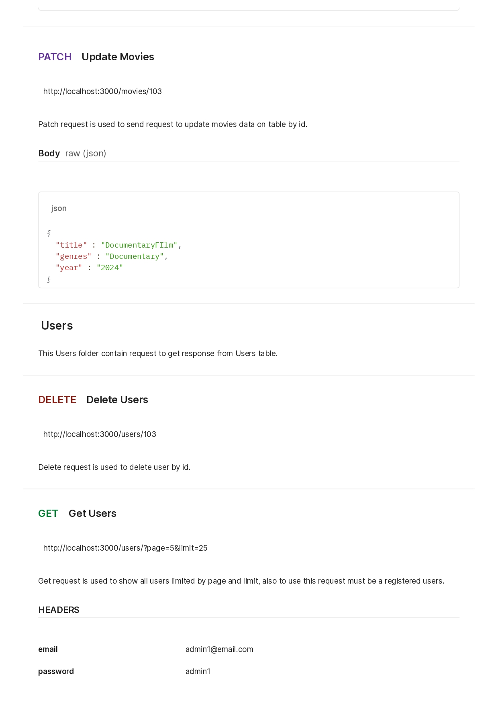

# Restfull API and Middleware

## Table of contents

- [Overview](#overview)
  - [The challenge](#the-challenge)
  - [Documentation](#documentation)
  - [Links](#links)
- [My process](#my-process)

## Overview

### The challenge
- Membuat RESTful API menggunakan Express
- Melakukan authorization dan authentication dengan menggunakan middleware
- Membuat dokumentasi API menggunakan Swagger

### Documentation

### Links

- Solution file: [solution_file](app.js)

## My process
- Lakukan koneksi pada database yang telah diimport
- Mulai membuat routing pada Express untuk endpoint-endpoint yang dibutuhkan
- Mulai membuat middleware untuk implementasi authentication dan authorization
- Menginstall package swagger dan mengimplementasikan dokumentasi AP

